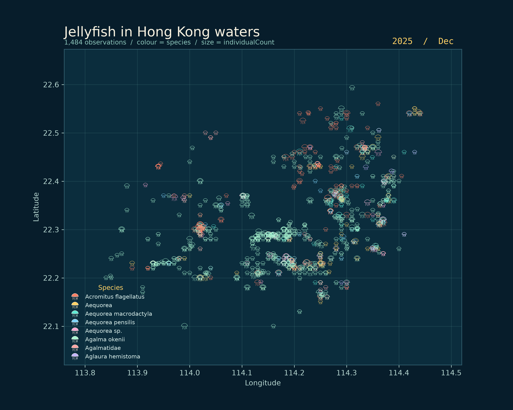
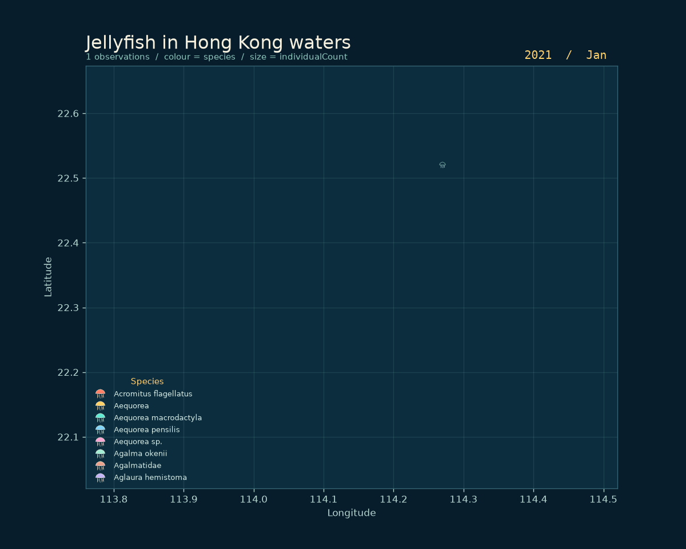

# Hong Kong Jellyfish

## The phenomenon

Jellyfish observations in Hong Kong waters rise and fall through time and are
not spread evenly across the coastline. I looked at this phenomenon because
citizen-science records can show both seasonal changes and the places where
people are most likely to encounter jellyfish. The dataset covers observations
from 2021 to 2025, so it also makes a useful small record of change over time.

## The source

The data comes from the [Jellyfish in Hong Kong: a citizen science dataset](https://ipt.taibif.tw/resource?r=hk-jellyfish), published through TaiBIF. The downloaded file contains 1,536 rows; each row represents one observation, with latitude and longitude in decimal degrees, `eventDate` as an observation date, `scientificName` as the recorded species, and `individualCount` as a count of individuals.

## The picture





Each observation is drawn as a jellyfish glyph at its recorded longitude and latitude. Colour represents `scientificName`, size represents `individualCount`, and the GIF reveals the observations in chronological order using `eventDate`. The picture hides exact coastlines, observation photographs, time of day, and uncertainty in the locations; it also makes overlapping observations look like one cluster, so it is a summary rather than a complete map of jellyfish abundance.

## How to run

```bash
uv run plot.py
```